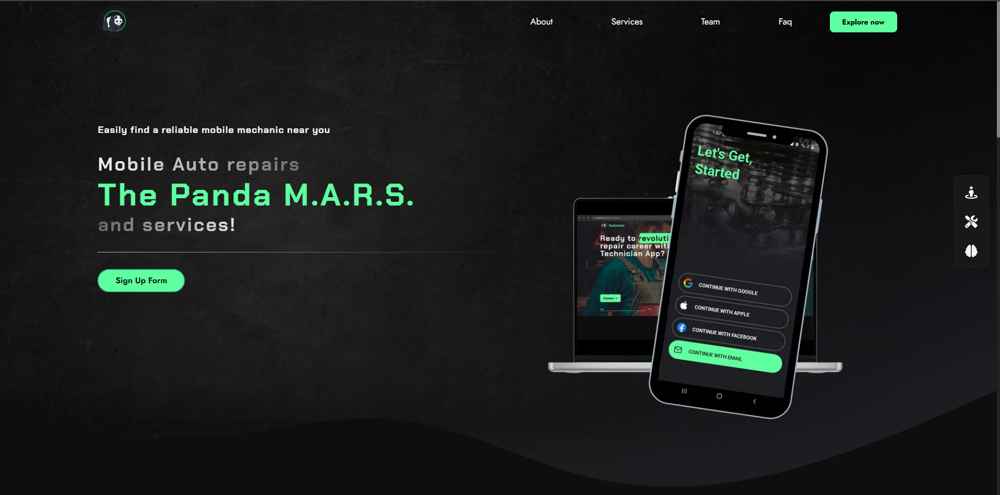

# Panda Mars Web Platform

[](https://www.app.panda-mars.com)

Welcome to **Panda Mars**, the ultimate web platform designed to connect technicians with customers who need roadside assistance. This project serves as a bridge between users and experts, ensuring a seamless experience for quick and reliable vehicle repairs.

  
*Illustrative image of the Panda Mars platform.*

## 🌟 **Live Demo**

Visit the live application here: [Panda Mars Web](https://www.app.panda-mars.com)

---

## 🚀 **Features**

- **User-Friendly Interface**: A responsive and intuitive design tailored for both desktop and mobile users.
- **Technician Dashboard**: Tools for technicians to manage service requests, view customer details, and track real-time locations.
- **Customer Services**: Customers can easily request assistance, receive offers, and track technician arrival times.
- **Secure Payments**: Integrated payment gateway with Stripe for seamless transactions.
- **Real-Time Updates**: Built with GraphQL for live data synchronization between users and technicians.

---

## 🛠️ **Technologies Used**

- **Frontend**: Next.js, React, Tailwind CSS.
- **Backend Services**: AWS AppSync (GraphQL), Cognito, Lambda, S3.
- **Database**: PostgreSQL.
- **Deployment**: AWS Amplify.
- **Payment Integration**: Stripe.

---

## 📖 **How It Works**

1. **For Technicians**:
   - Sign up and log in through a secure authentication system.
   - View service requests in real-time on the dashboard.
   - Send offers to customers and finalize deals.
   - Navigate to the customer’s location using integrated maps.

2. **For Customers**:
   - Create a service request detailing the problem and location.
   - Receive multiple offers from nearby technicians.
   - Select the most suitable offer and confirm the service.
   - Make secure payments directly on the platform.

---

## 📂 **Project Structure**

```plaintext
.
├── amplify/              # AWS Amplify configurations
├── src/
│   ├── components/      # Reusable React components
│   ├── graphql/         # GraphQL queries and mutations
│   ├── pages/           # Next.js pages
│   ├── styles/          # Tailwind CSS configurations
│   └── utils/           # Utility functions
├── public/              # Static assets
└── README.md            # Project documentation
```

---

## 📧 **Contact**

If you have any questions or feedback, feel free to reach out:

- **Email**: jareddelgadotejada.41@gmail.com
- **GitHub**: [@jareddelgado454](https://github.com/jareddelgado454)

---

## 📝 **Note**

This is a private project and contributions are not accepted at this time. The platform is designed for professional use and serves a specific user base.

---

Thank you for checking out **Panda Mars**! 🌌